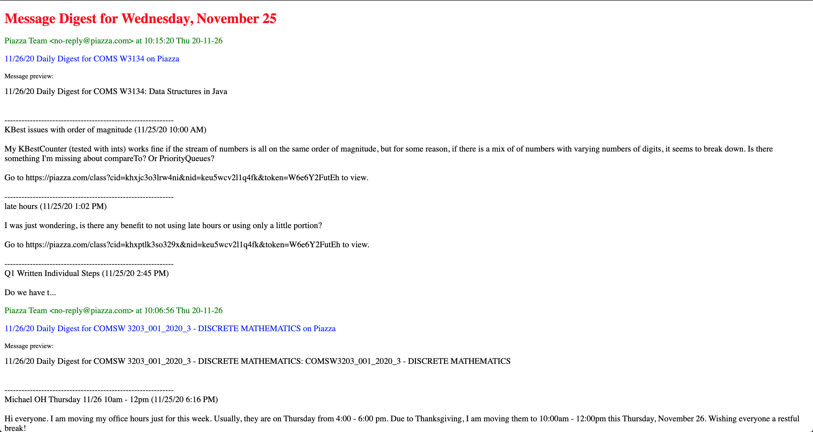
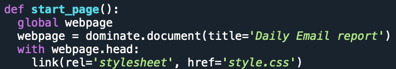

# Gmail Email Compiler

A personal use script to compile my daily emails into a readable webpage.  
emailcompiler.py requires changes to a list of search paramaters that the user chooses to curate their daily email brief.  
When run, it creates an html webpage that displays summaries of all retrieved emails, downloads that html file in the specified directory in the user's computer, downloads any email attachments to that same directory (attachments linked in the html file), and prompts the user to decide whether or not to mark all compiled emails as read. 
If the user selects 'yes' the emails are marked as read.

The script contains an optional link to an external css stylesheet 'style.css' if the user desires more flexible display styling.  
The style folder of this repository contains a template style.css file that must be stored in the same directory as the emailcompiler.py file.

The webpage can be displayed with only in-line styling:  

Which results in a mail summary that looks like this:  

Or with the external styling linked:  

Which (with the template style.css) results in this:  

